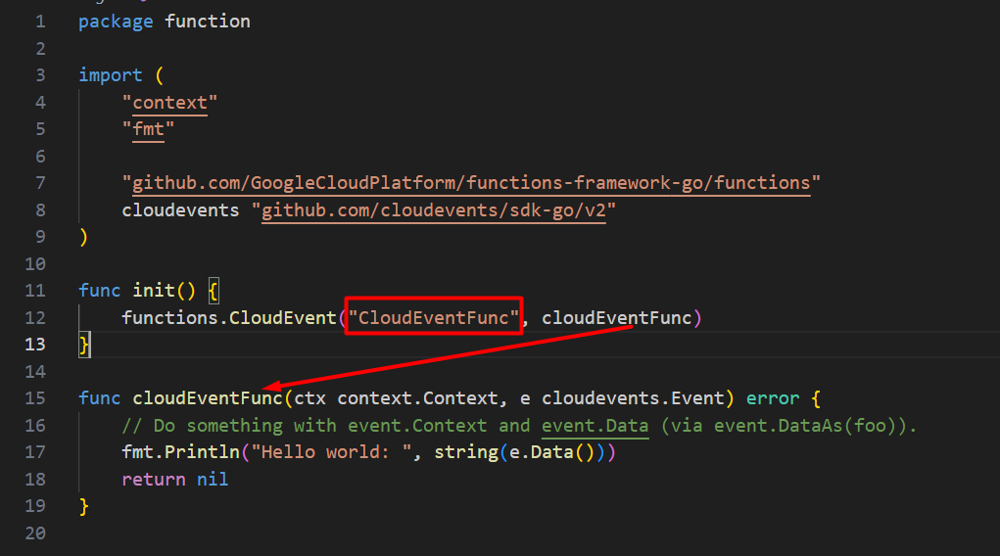

# Running Golang Locally

## Descriptions
- The function.go file would be the logic of deploy.
- The cmd/init.go file to up a server to execute the cloud function function.go
- The cmd/testing/event.go allow execute a request to server

## Steps:
1. Configure the function.go the logic to develop
2. Run:
    ``` shell 
    export FUNCTION_TARGET=CloudEventFunc
    ```
    
3. Run 
    ``` shell
        go run cmd/main.go
    ```
4. Run
    ``` shell
    go run cmd/testing/event.go
    ```
### Annotations
- The port 8080 would be free or change in the cmd/init.go